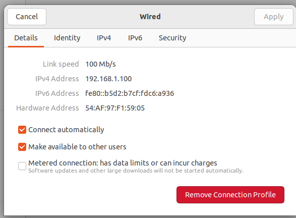

# Communication Setup Guideline for Rocket M2

This file goes through the steps needed to setup communication between the rover i.e. the Jetson, and the base station i.e. an Ubuntu laptop.

We primarily use ROCKET M2 routers for communication between the rover and the ground station.

## 🔨 Required Hardware 

- Rocket M2s
- PoE supported ethernet cables
- Ethernet LAN cables
- Adapters for the Rocket M2s
- Antennas (sector/omnidirectional/dipole)
- USB to Ethernet adapter (if the base station laptop has no LAN port)

## ⚙️ Configuration

The long gray ethernet cable that supports PoE (Power over Ethernet) is always connected to the ROCKET M2 router and the white smaller LAN cable is connected to the laptop (in case of the base station sector antenna) or the Jetson (in case of the rover).

Whenever testing the rover using this communication setup, make sure that both the ROCKET M2 are connected to an antenna (at least connected to dipole antenna or better if their respective sector/omnidirectional antenna). But at least one antenna should stay connnected to the router all the time during any operation.


## 🛜 IPv4 Configuration
After connecting the wires properly to the base station antenna and the laptop, we need to configure our network settings (you need to repeat the same steps in the Jetson after connecting wires properly to the jetson and ROCKET M2 router):


- Go to Network settings -> Wired connection -> ⚙️ (Settings)
- Go to the IPv4 tab
- By default, IPv4 Method will be set to 'Automatic(DHCP)', we need to select 'Manual'.
- We need to type the Addresses. In the **Adrress** type `192.168.1.100` in case of base station. For the Jetson, set it to `192.168.1.2`.
- Netmask is `255.255.255.0` same for both laptop and jetson.

**Rover IP**
| IP address      | Netmask      | 
|---------------|---------------|
| 192.168.1.2  | 255.255.255.0  |

**Base Station IP**
| IP address      | Netmask      | 
|---------------|---------------|
| 192.168.1.100  | 255.255.255.0  |

- After this, disconnect and reconnect the ethernet cable. Now you should see something like this:



---
# 🛠️ Check the Network Configuration

Currently we have our laptop connected to base station's ROCKET M2

To verify this, open terminal and run:

```bash
hostname -I
```
In terminal you should see an address like this:
```bash
192.168.1.100
```

The Jetson is also connected to another ROCKET M2.
Similary, to verify/access its ip address, run this in the Jetson:
```bash
hostname -I
```
You should see something like this:
```bash
192.168.1.2
```
---

## 📱💻 Ping

Now we want to verify that both our jetson nano and laptop (base station) is connected to the same network.
For this, we'll try to ping the jetson using our laptop.
On the base station, run in a terminal:
```bash
ping 192.168.1.2
```

Upon successful ping, you should see something like this:

---


>⚠️ Remember, our base station(i.e. laptop) ip address is `192.168.1.100`.\\
>If you see the above output, you can rest assure that your jetson and base station is connected in the same network.

## 📱💻 SSH

Now that both our jetson nano and the base station(laptop) are in the same network,
we can access the jetson(that is situated in the rover) by a process called 'ssh'

WRITE THIS IN A BASE STATION TERMINAL:

```bash
ssh interplanetar@192.168.1.2
```
This will prompt you to input password of the jetson nano
After typing the correct password, your terminal should look something like this:

---


---


⚠️ Take a good look, the username and other credentials have changed to interplanetar after successful ssh
It shows that our ssh was successful and now we have complete access to the jetson nano
We can try this command:
```bash
ls
```
It will show the workspaces and file that are inside the jetson

## Docker inside Jetson

We have docker installed in our jetson nano
We can see the container list using this following command:
```bash
docker ps -a
```
---
You should see a container named 'humble-nano'. This is the container that we will be using.

Now start the container:

```bash
docker start -i humble-nano
```
> **NOTE:** The name is set for the container when it was run for the first time in the Jetson Nano, and the name may vary between different containers.
---


---
On successful running, you should see the username getting changed to `roverNano`, which tells us that we indeed are now inside the ros2 humble container, and now we can do all sorts of stuff that we want using ROS2.

---
## Running a node in Laptop i.e. Base station

Now create a new window in terminal.
And from there run any ros2 node you want(Here's a demo version)
Here we ran the GUI node of the rover:
```bash
cd ros2_nafi_ws
source install/setup.bash
ros2 run combined_gui gui_node
```


Now in another window, run this:
```bash
ros2 topic list
```


## Topic list in ros-humble inside Docker

Now in the terminal where ssh i.e. jetson nano i.e. 'humble-nano' container is running, write the same command:
```bash
ros2 topic list
```
See, they are the same topic that are in the laptop i.e. base station. Which tells us that our jetson can now access those same topic.


